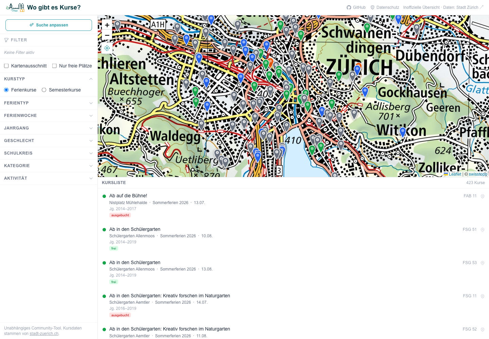

# wogibteskurse

An interactive map for exploring kids' sport and leisure courses offered by the City of Zürich. Browse, filter, and discover courses spatially — something the official portal doesn't support.

**Live:** [wogibteskurse.fly.dev](https://wogibteskurse.fly.dev)

> **Disclaimer:** This project is an independent, community-built tool. It is **not** created by, affiliated with, or endorsed by the City of Zürich or any of its departments. Course data is fetched in real time from the public sport portal at `stadt-zuerich.ch`. Use this application at your own risk. Always verify course details on the [official portal](https://www.stadt-zuerich.ch/sport-portal) before making any decisions or bookings.

---

## What it does

- Displays Zürich kids' courses (Ferienkurse & Semesterkurse) as pins on a swisstopo map
- Guided onboarding wizard to quickly narrow down by course type, holiday period, and birth year
- Supports all the same filters as the official portal: sport/activity, holiday type, holiday week, school district, birth year, gender, category
- Adds a **map area filter** — show only courses within the current map view
- Groups overlapping pins at the same venue; click to browse all courses there
- Click any pin to see full course details and a direct booking link
- Mobile-friendly with a tab bar (map / list / filter) and bottom sheet

## Screenshot



---

## Tech Stack

| Layer           | Technology                                                                                                                               |
| --------------- | ---------------------------------------------------------------------------------------------------------------------------------------- |
| Framework       | [Next.js 16](https://nextjs.org) (App Router, TypeScript)                                                                                |
| UI              | React 19, [Tailwind CSS v4](https://tailwindcss.com)                                                                                     |
| Map             | [Leaflet](https://leafletjs.com) via [react-leaflet v5](https://react-leaflet.js.org), [swisstopo WMTS tiles](https://api3.geo.admin.ch) |
| Geocoding cache | SQLite via [better-sqlite3](https://github.com/WiseLibs/better-sqlite3)                                                                  |
| Deployment      | [Fly.io](https://fly.io) (auto-deploy on push to `main`)                                                                                 |

---

## Data Sources

| Source                                                                 | Usage                                   |
| ---------------------------------------------------------------------- | --------------------------------------- |
| [Stadt Zürich Sport Portal](https://www.stadt-zuerich.ch/sport-portal) | Course data (fetched live, 5 min cache) |
| [swisstopo geocoding API](https://api3.geo.admin.ch)                   | Resolving venue names to coordinates    |
| [swisstopo WMTS](https://wmts.geo.admin.ch)                            | Map tiles                               |

Course coordinates are not provided by the sport portal API directly. Venue names are resolved to coordinates using the swisstopo geocoding API and cached locally in SQLite.

---

## Running locally

### With Docker

```bash
docker compose up
```

The app will be available at [http://localhost:3000](http://localhost:3000). The geocoding cache (SQLite) is stored in `./data/geocode.db` and persists between restarts.

### Without Docker

```bash
npm install
npm run dev
```

Requires Node.js 20+. No `.env` file needed — defaults work out of the box.

**Optional environment variables:**

| Variable        | Default             | Description              |
| --------------- | ------------------- | ------------------------ |
| `DATABASE_PATH` | `./data/geocode.db` | SQLite database location |

---

## Project Structure

```
wogibteskurse/
├── app/
│   ├── api/
│   │   ├── courses/        # Proxy + geocoding + bounds filter
│   │   ├── image/[id]/     # Course image cache endpoint
│   │   └── lookups/        # Filter options (ferientyp, ferienwoche, …)
│   ├── page.tsx
│   └── layout.tsx
├── components/
│   ├── MapPage.tsx         # Main controller (state, filters, mobile tabs)
│   ├── MapView.tsx         # Leaflet map with swisstopo tiles
│   ├── FilterPanel.tsx     # Filter sidebar
│   ├── CourseList.tsx      # Scrollable course list
│   ├── CoursePopup.tsx     # Course detail panel
│   └── WizardModal.tsx     # Onboarding wizard
├── lib/
│   ├── geocoder.ts         # Venue geocoding + SQLite cache
│   ├── sportPortal.ts      # Zürich API client (XSRF handling, pagination)
│   ├── urlState.ts         # Filter ↔ URL params serialization
│   └── db.ts               # SQLite connection + venue overrides
├── __tests__/              # Vitest tests
├── data/                   # SQLite geocoding cache (gitignored)
├── docs/
│   └── api.md              # Sport portal API research notes
├── Dockerfile
├── docker-compose.yml
└── fly.toml
```

---

## Filters

| Filter           | Description                                                        |
| ---------------- | ------------------------------------------------------------------ |
| Kurstyp          | Ferienkurse or Semesterkurse                                       |
| Ferientyp        | Holiday period (Sommerferien, Herbstferien, etc.)                  |
| Ferienwoche      | Week within the holiday (1st–5th week)                             |
| Aktivität        | Sport or activity type (75+ options)                               |
| Schulkreis       | School district (7 districts in Zürich)                            |
| Kategorie        | Course category (Sport, Freizeit, Kombi, Online)                   |
| Jahrgang         | Child's birth year                                                 |
| Geschlecht       | Gender                                                             |
| Freie Plätze     | Only show courses with available spots                             |
| Kartenausschnitt | Only show courses within the current map view (unique to this app) |

---

## Contributing

Contributions are welcome. Please open an issue before submitting a pull request for larger changes.

## License

MIT
